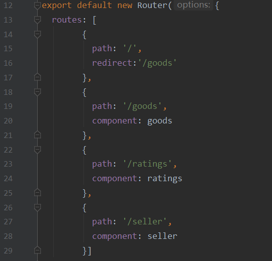

# 饿了么

> Vue.js搭建的饿了么项目

## Build Setup

``` bash
# install dependencies
npm install

# serve with hot reload at localhost:8080
npm run dev

# build for production with minification
npm run build

# build for production and view the bundle analyzer report
npm run build --report

# run unit tests
npm run unit

# run e2e tests
npm run e2e

# run all tests
npm test
```

For a detailed explanation on how things work, check out the [guide](http://vuejs-templates.github.io/webpack/) and [docs for vue-loader](http://vuejs.github.io/vue-loader).

## 项目预备知识

> 1. Vue.js基础知识（Vue.js实战[梁灏]、官方文档https://cn.vuejs.org/v2/guide/）
> 2. Vue cli的使用
> 3. JavaScript、ES6（JavaScript高级程序设计第三版、ES6标准入门[阮一峰]）
> 4. stylus基础知识[https://stylus.bootcss.com/](https://stylus.bootcss.com/)
> 5. better-scroll负责页面滑动的，这个比较好用（https://ustbhuangyi.github.io/better-scroll/doc/zh-hans/#better-scroll）

## 项目包准备

> 1. stylus:
>
>    ```bash
>    cnpm i stylus stylus-loader -S
>    ```
>
> 2. vue-resource:
>
>    ```bash
>    cnpm i vue-resource -S
>    ```
>
> 3. better-scroll：
>
>    ```bash
>    cnpm i better-scroll -S
>    ```
>

## 项目结构

> 左图是整个项目的目录，右图是项目中src的目录
>
> 

## 项目路由

>       

## 项目组件

#### 子组件

> src/components/header（头部组件）：
>
>  

> src/components/shopcart（底部组件）：
>
>  

> src/components/cartControl（商品数量控制组件）：
>
>  

> src/components/star（星级评价组件）：
>
>  

> src/components/ratingselect（评价组件）
>
>  

> src/components/food（食物详情组件）：
>
>  

#### 项目入口组件

> 剩下的src/components/goods、src/components/ratings以及src/components/seller分别如下图所示：
>
> 

## 后台数据

> 这里的后台数据我们用死数据，即来自src/common/json/data.json中。
